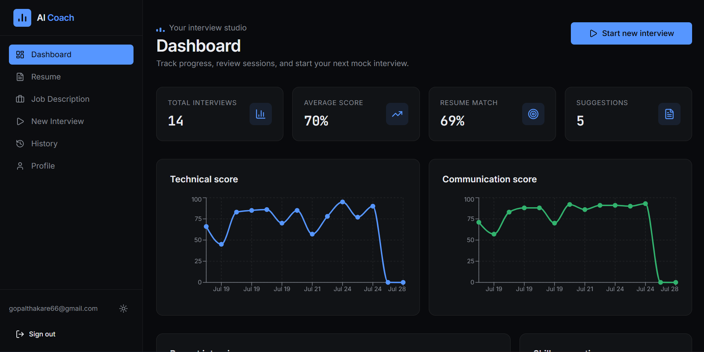
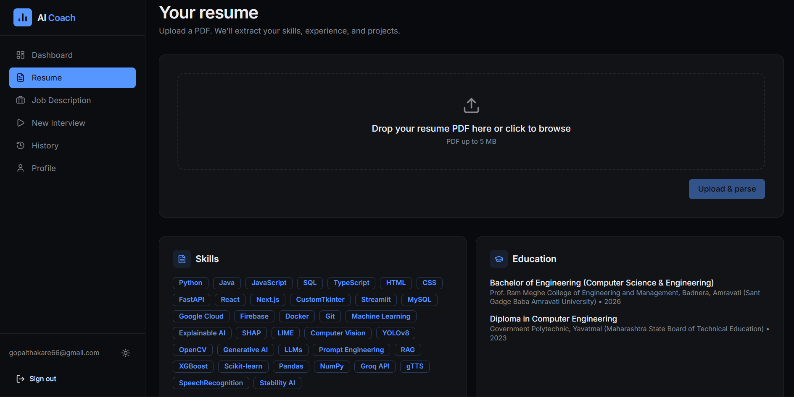
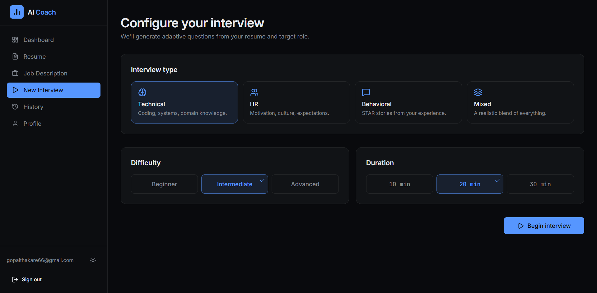
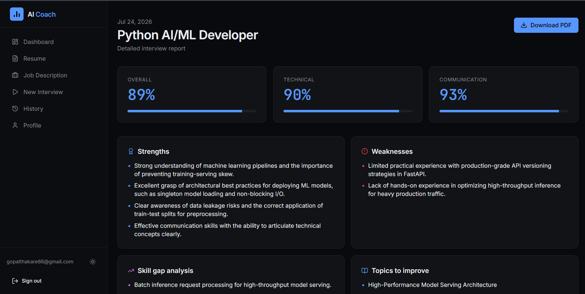
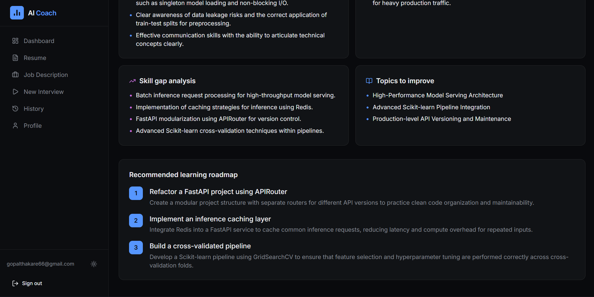

# 🎯 AI Interview Coach

An AI-powered interview platform that helps candidates prepare for technical, HR, behavioral, and mixed interviews by analyzing their resume and job description, generating adaptive interview questions, evaluating responses, and providing personalized feedback.

---

## ✨ Features

### 📄 Resume Analysis
- Upload and parse resumes automatically
- Extract skills, education, experience, projects, and certifications
- AI-powered resume understanding

### 💼 Job Description Analysis
- Parse job descriptions
- Extract:
  - Role
  - Required Skills
  - Preferred Skills
  - Responsibilities
- Generate resume-job match analysis

### 🤖 AI Interview Engine
Supports multiple interview modes:

- Technical Interview
- HR Interview
- Behavioral Interview
- Mixed Interview

Features include:

- Resume-aware questions
- Job description-aware questions
- Adaptive difficulty
- Natural follow-up questions
- Conversation memory
- Project-based technical questions

### 📝 AI Answer Evaluation

Each answer is evaluated on:

- Technical Accuracy
- Communication
- Completeness
- Problem Solving

The platform also provides:

- Correct explanations
- Missing concepts
- Improvement suggestions
- Overall score

### 📊 Interview Report

Generate a detailed report including:

- Overall Interview Score
- Technical Score
- Communication Score
- Strengths
- Weaknesses
- Skill Gaps
- Topics to Improve
- Personalized Learning Roadmap

### 📈 Dashboard

Track your interview performance with:

- Interview History
- Average Score
- Resume Match Score
- Performance Trends
- Technical Score History
- Communication Score History

### 🎙 Voice Interview Support

- Voice input for answers
- Transcript panel
- Camera preview
- Interview timer

---

# 🖥 Screenshots

## 🏠 Dashboard



---

## 📄 Resume Analysis



---

## 🎤 Interview



---

## 📊 Report




---

# 🛠 Tech Stack

## Frontend

- React
- TypeScript
- Tailwind CSS
- Vite
- React Router
- Recharts
- Lucide Icons

## Backend

- FastAPI
- Python

## AI

- Google Gemini
- Groq API
- Explainable AI Prompt Engineering

## Machine Learning

- Scikit-learn
- SHAP
- LIME
- Pandas
- NumPy

## Database

- SQLite
- SQLAlchemy

## Authentication

- JWT Authentication
- Password Hashing

---

# 🚀 Project Structure

```
AI-Interview-Coach/
│
├── backend/
│   ├── app/
│   ├── models/
│   ├── routes/
│   ├── services/
│   ├── prompts.py
│   └── main.py
│
├── frontend/
│   ├── src/
│   ├── components/
│   ├── pages/
│   └── assets/
│
├── screenshots/
│
├── README.md
└── requirements.txt
```

---

# ⚙ Installation

## Clone the repository

```bash
git clone https://github.com/gopalthakare/ai-interview-coach.git

cd ai-interview-coach
```

---

## Backend

```bash
cd backend

python -m venv venv

source venv/bin/activate
```

Windows

```bash
venv\Scripts\activate
```

Install dependencies

```bash
pip install -r requirements.txt
```

Create a `.env` file

```env
GEMINI_API_KEY=your_key
GROQ_API_KEY=your_key
JWT_SECRET=your_secret
```

Run backend

```bash
uvicorn app.main:app --reload
```

Backend runs on:

```
http://127.0.0.1:8000
```

---

## Frontend

```bash
cd frontend

npm install

npm run dev
```

Frontend runs on:

```
http://localhost:5173
```

---

# 🧠 AI Workflow

```
Resume
        │
        ▼
 Resume Parser
        │
        ▼
Job Description Parser
        │
        ▼
Resume Match Analysis
        │
        ▼
Interview Planner
        │
        ▼
Adaptive Question Generation
        │
        ▼
Candidate Answer
        │
        ▼
AI Evaluation
        │
        ▼
Performance Tracking
        │
        ▼
Final Interview Report
```

---

# ⭐ Highlights

- Resume-aware interviewing
- Job description-aware interviews
- Adaptive interview difficulty
- AI-generated follow-up questions
- Technical, HR, Behavioral and Mixed interviews
- Explainable evaluation
- Personalized learning roadmap
- Gemini with Groq fallback support
- Modern SaaS-inspired interface
- Responsive design

---

# 🔮 Future Improvements

- LLM-based semantic resume matching
- Project-aware interview planning
- Better evaluation memory
- Live coding interview mode
- Webcam behavior analysis
- Speech emotion analysis
- Multi-language interviews
- AI interview coach
- Cloud deployment
- Admin dashboard

---

# 👨‍💻 Author

**Gopal Thakare**

Computer Science Engineer | AI/ML Developer | Python Backend Developer

GitHub: https://github.com/gopalthakare

LinkedIn: https://linkedin.com/in/gopalthakare14

---

# 📄 License

This project is licensed under the MIT License.

---

## ⭐ If you found this project useful, consider giving it a star!