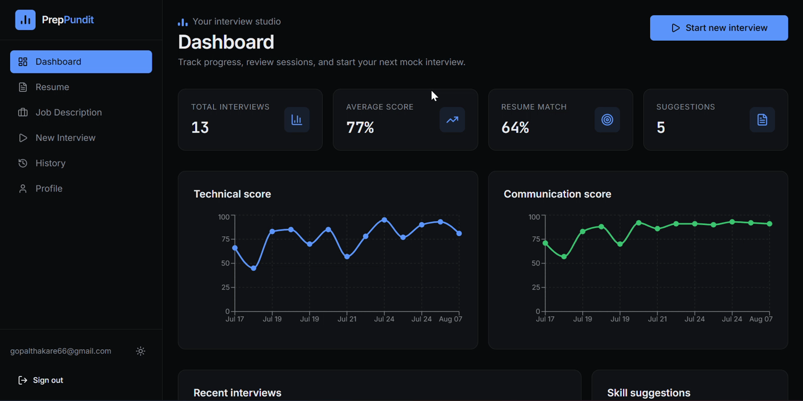
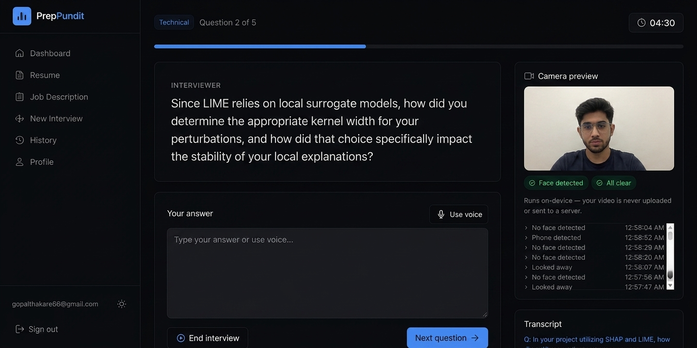

# 🎯 PrepPundit

An AI-powered mock interview platform that analyzes your resume and a target job description, runs adaptive technical/HR/behavioral interviews, evaluates your answers, and gives you a personalized report and learning roadmap — with on-device webcam proctoring so you can practice under realistic conditions.

**Repo:** https://github.com/gopalthakare/preppundit

---

## ✨ Features

### 📄 Resume Analysis
- Upload a PDF resume — parsed automatically via LLM
- Extracts skills, education, experience, projects, and certifications

### 💼 Job Description Analysis & Resume Matching
- Paste any JD or pick a predefined role
- Extracts required skills, preferred skills, and responsibilities
- Scores resume-to-JD fit with a custom matching engine that goes beyond exact string matching — normalizes casing, expands common synonyms/aliases (e.g. "Vector DBs" ↔ "Pinecone"/"FAISS"), and tolerates version suffixes (e.g. "YOLO" ↔ "YOLOv8")

### 🤖 AI Interview Engine
Four modes — Technical, HR, Behavioral, Mixed — with:
- Resume-aware and JD-aware question generation
- Adjustable difficulty and duration
- Gemini + Groq LLM backends with automatic fallback between them

### 📝 AI Answer Evaluation
Each answer is scored on Technical Accuracy, Communication, Completeness, and Problem Solving, with explanations, missing concepts, and improvement suggestions.

### 📊 Interview Report
Overall/Technical/Communication scores, strengths, weaknesses, skill-gap analysis, topics to improve, and a personalized learning roadmap — downloadable as a PDF.

### 📈 Dashboard & History
Interview history, average score, resume-match trend, and score history over time.

### 🎙 Voice Answering
Speak your answers instead of typing — live transcription via the browser's Web Speech API (Chrome/Edge).

### 📷 On-Device Interview Proctoring
Runs entirely in your browser — no video is ever uploaded:
- Face presence detection (flags if you step out of frame)
- Head-pose "looking away" detection
- Phone detection in frame
- Tab-switch detection while the interview is active
- Live violations log

---

## 🖥 Screenshots

### 🏠 Dashboard



---

### 📄 Resume Analysis


---

### 💼 Job Description Analysis


---

### 🎤 Live Interview



---

### 📊 Interview Report


---

## 🛠 Tech Stack

**Frontend**
- TanStack Start (React 19) + TypeScript
- Tailwind CSS v4 + shadcn/ui
- TanStack Router + TanStack Query
- Recharts, Lucide Icons

**Backend**
- FastAPI (Python)
- SQLAlchemy + SQLite
- JWT auth (python-jose) + bcrypt password hashing
- pypdf (resume text extraction), reportlab (report PDF generation)

**AI**
- Google Gemini + Groq, with automatic fallback between providers
- Prompt-engineered resume parsing, JD analysis, question generation, and answer evaluation
- Custom skill-matching engine (normalization + alias table + fuzzy matching)

**On-device Computer Vision**
- MediaPipe Tasks Vision (Face Landmarker) — face presence & head-pose
- TensorFlow.js + COCO-SSD — phone detection

---

## 🚀 Project Structure

```
preppundit/
│
├── backend/
│   └── app/
│       ├── routers/       # auth, resume, job, interview, report, history, dashboard, profile
│       ├── services/      # ai_provider, resume_parser, jd_analyzer, matcher, question_generator,
│       │                  # answer_evaluator, report_builder
│       ├── models.py
│       ├── schemas.py
│       ├── security.py
│       ├── config.py
│       └── main.py
│
├── src/                   # TanStack Start frontend
│   ├── routes/
│   ├── components/
│   └── hooks/
│
├── screenshots/
├── package.json
└── README.md
```

---

## ⚙ Installation

### Clone the repository
```bash
git clone https://github.com/gopalthakare/preppundit.git
cd preppundit
```

### Backend
```bash
cd backend
python -m venv venv
source venv/bin/activate      # Windows: venv\Scripts\activate
pip install -r requirements.txt
```

Create a `.env` file in `backend/`:
```env
SECRET_KEY=change-this-to-a-random-secret
DATABASE_URL=sqlite:///./interview_coach.db
FRONTEND_ORIGIN=http://localhost:8080

AI_PROVIDER=gemini          # gemini | groq | openai | mock
GEMINI_API_KEY=your_key
GEMINI_MODEL=gemini-2.5-flash
GROQ_API_KEY=your_key
GROQ_MODEL=llama-3.3-70b-versatile
```

Run it:
```bash
uvicorn app.main:app --reload
```
Backend runs on `http://127.0.0.1:8000`.

### Frontend
From the project root:
```bash
npm install
npm run dev
```
Frontend runs on `http://localhost:8080`.

---

## 🧠 Workflow

```
Resume ──► Resume Parser ──┐
                            ├──► Resume ↔ JD Match Score
Job Description ──► JD Parser ──┘
                            │
                            ▼
                  Adaptive Question Generation
                            │
                            ▼
                    Candidate Answer
                    (typed / voice / on-device proctored)
                            │
                            ▼
                     AI Evaluation
                            │
                            ▼
                Performance Tracking + Final Report
```

---

## ⭐ Highlights
- Resume-aware and JD-aware adaptive interviewing
- Explainable, per-dimension answer evaluation
- Personalized learning roadmap
- Gemini + Groq fallback for resilience
- On-device webcam & tab-switch proctoring — no video leaves the browser
- Modern, responsive dark/light UI

---

## 🔮 Future Improvements
- LLM-based semantic resume matching (beyond the current alias/fuzzy matcher)
- Live coding interview mode
- Speech emotion/confidence analysis
- Multi-language interview support
- Automated test suite + CI pipeline
- Cloud deployment
- Admin dashboard

---

## 👨‍💻 Author

**Gopal Thakare**
Computer Science Engineer | AI/ML Developer | Python Backend Developer

- GitHub: https://github.com/gopalthakare
- LinkedIn: https://linkedin.com/in/gopalthakare14

---

## 📄 License
This project is licensed under the MIT License.

---

⭐ If you found this project useful, consider giving it a star!
